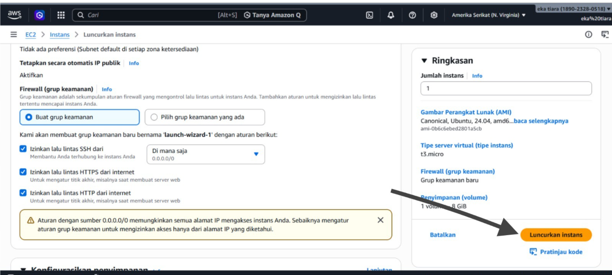

1. Pilih Menu All Services -> EC2

2. Di dalam Menu EC2 kita pilih instance

3. di dalam menu instance pilih launch instance

4. beri nama instance kita dengan format NIM_Server

5. kita pilih OS Sever untuk instance

6. pilih Resource instance T3.Micro (2VCPU, 1GB Memory)

7. Membuat key Pair, pilih New Pair, isi nama key, pilih RSA, format file .

8. Setting Kebijakan Keamanan / Security Group
    - Allow SSH -> Artinya membolehkan REmove SSH dari luar 
    - Allow HTTPS -> Artinya Instance bisa diakses dari protocol HTTPS
    - Allow HTTP -> Artinya Instance bisa diakses dari protocol HTTP

9. Selesai Set-up Pilih launch Instance

10. Pastikan Launch Instance Sukses

