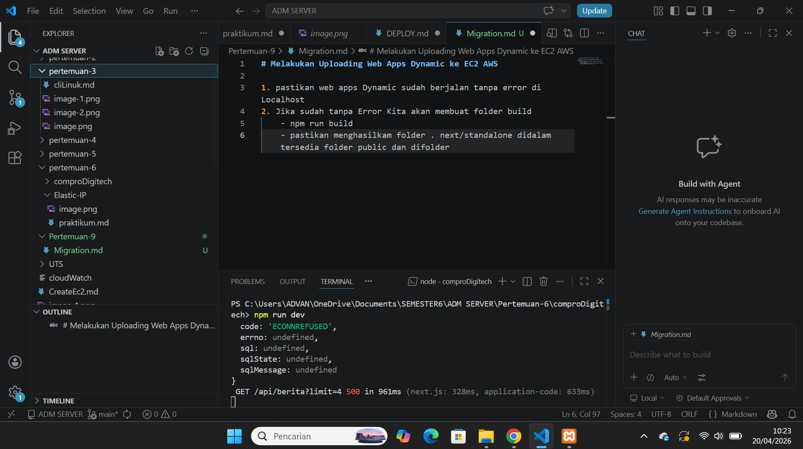
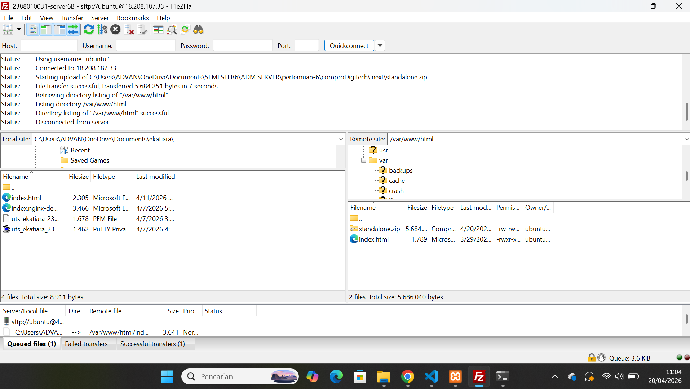
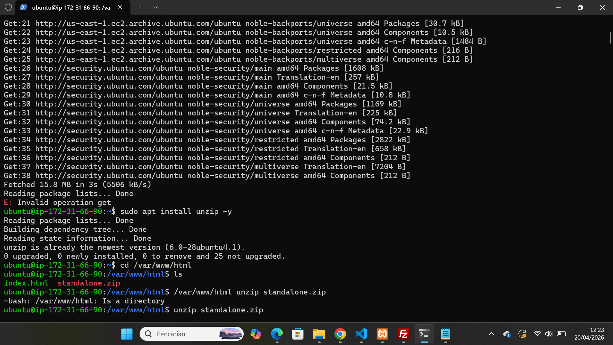
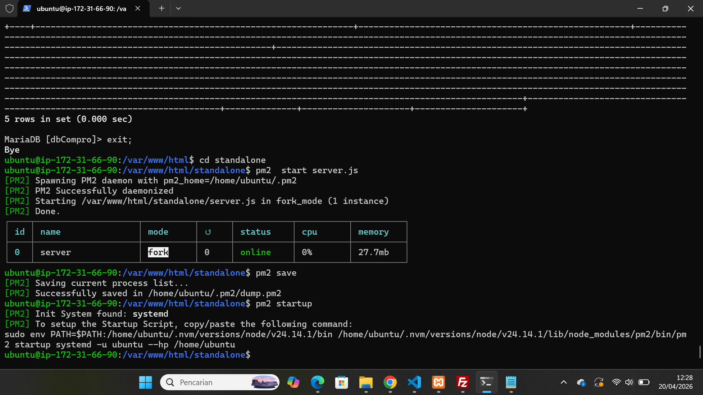
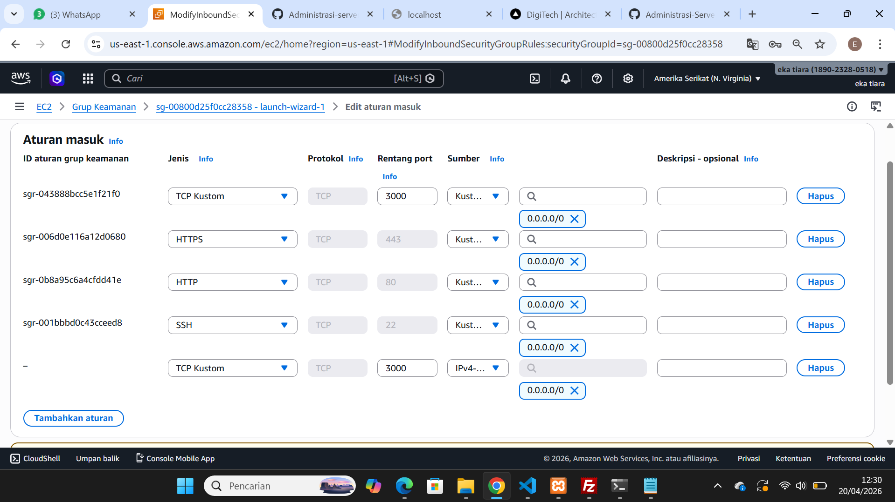
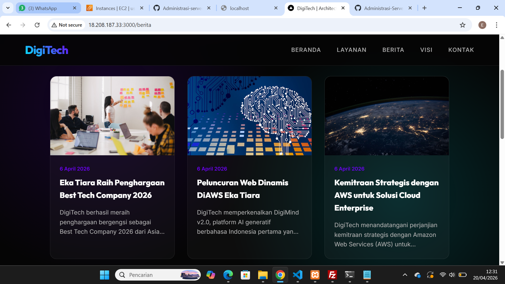

# Melakukan Uploading Web Apps Dynamic ke EC2 AWS

1. pastikan web apps Dynamic sudah berjalan tanpa error di Localhost

2. Jika sudah tanpa Error Kita akan membuat folder build 
    - npm run build
    - pastikan menghasilkam folder . next/standalone didalam tersedia folder public dan difolder .next ada folder static

3. proses upload file folder standlone
    - Lakukan Proses Archine pada folder .next/satndalone dan folder public .zip
    - Running Instance -> Connect Open SSH -> Connect fileZilla
    - upload file hasil archive .zip standalone ke ec2 AWS menggunakan Filezilla
    - extract file hasil archive di ec2 aws
   

    
    i. install tools unzip di ec2 aws
        - sudo apt install unzip -y
        
    ii. extract file hasil archive di ec2 aws
        - unzip standalone.zip
4. export dbCompro dari localhost import ke ec2 AWS
    - login ke SQL ec2 sudo mysql -u USERCOMPRO 
    - use dbCompro;
    - copy paste query SQL dari export dbCompro di Localhost
    - cek setiap tabel aoakah sudah terisi
        - select * from berita;
        - select * from users;
5. sesuaikan isi dile .env di ec2 aws
    - DB_HOST=localhost
    - DB_USER=USERCOMPRO
    - DB_PASSWORD=PASSWORD
    - DB_NAME=dbCompro
    - ctrl s
6. di terminal ssh cd ke folder standalone run apps -pm2 start server.js -pm2 save -pm2 startup

7. Buka port 3000 di security group ec2 aws
    - edit security group
    - add rule
    - save
    
    - Check Perubahan
    
