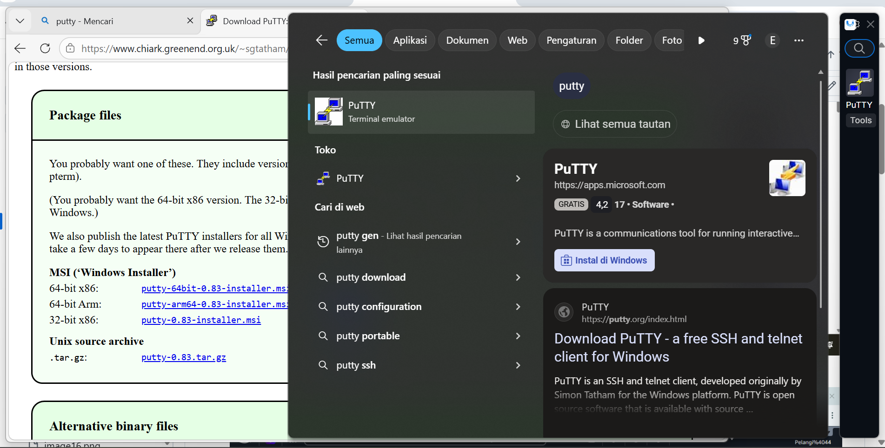
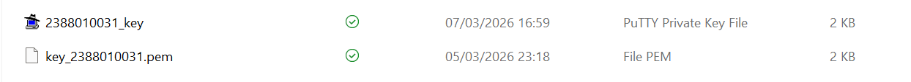

# Remote Instance with SSH putty

1. pastikan sudah install putty

2. konversi file Public Key dari .pem menjadi .ppk di putty
    - buka puttyGen
    - load file .pem
    - save as .appk
    

3. set Up Putty untuk Remote SSH
- buka apps Putty
- Isi IP Public sesuai instance
- Isi Port untuk SSH sesuai Security Group di Instance
- Isi Nama session agar saat connect lagi tinggal load saja
- load file .ppk (Klik SSH-> Auth -> Credentials ->load file .ppk)
- Kembali ke Session klik Save 
- Klik open 
- Masukan username sesuai instance

![alt text]

![alt text]
![alt text]

4. Sudo apt-get Update (Update OS) lanjut "sudo apt-get upgrade
