UAS administrasi Server 6B Eka Tiara 

1. Buat instance BAru di AWS EC2
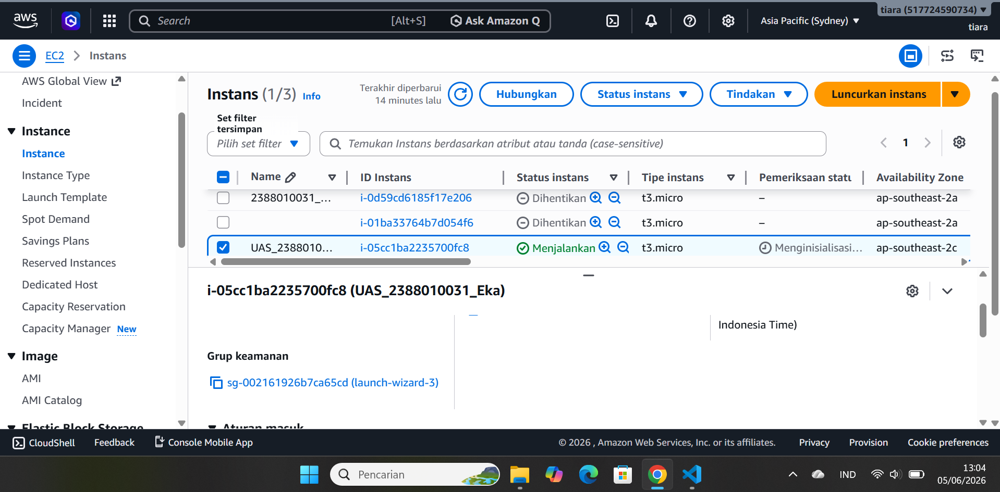

2. Add Security Group
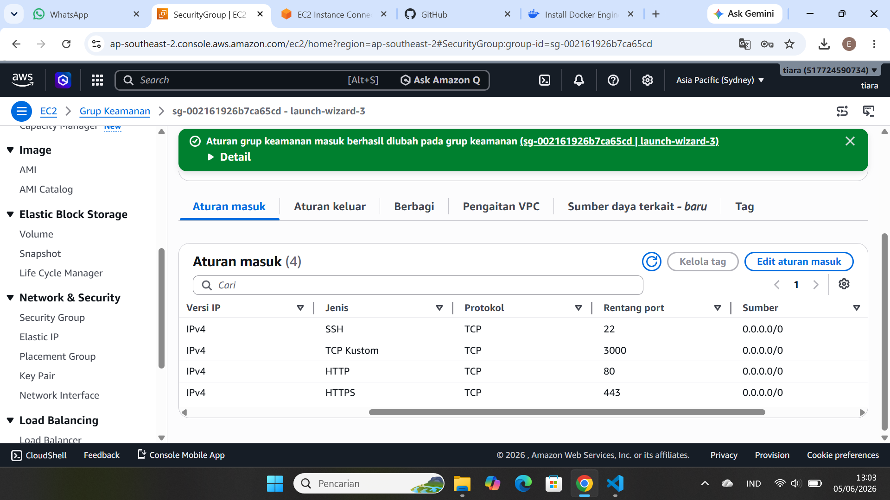

3. Pantching OS ubuntu  
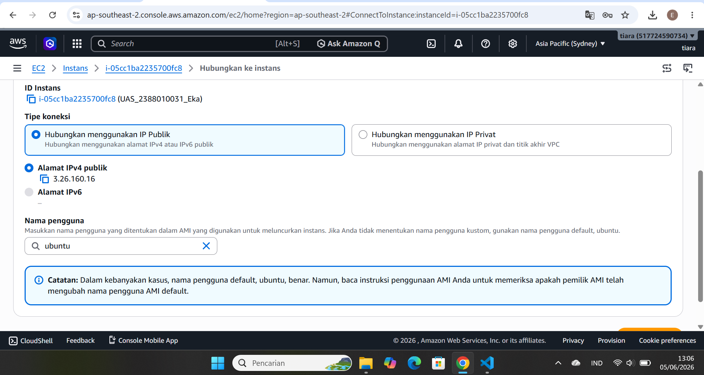
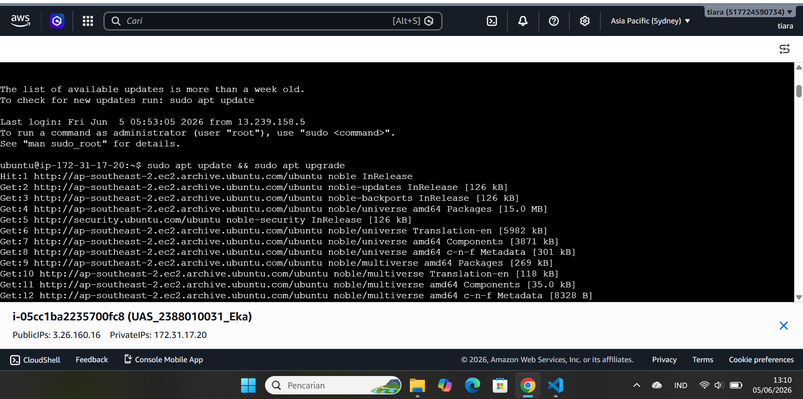

4. Buat Repo Githup dan setting secret_key
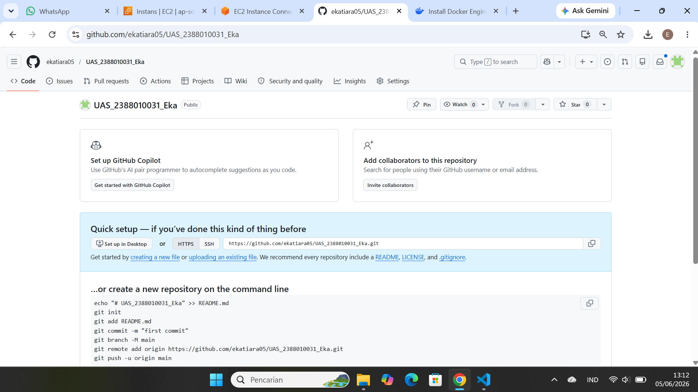

5. Install docker di terminal ubuntu 
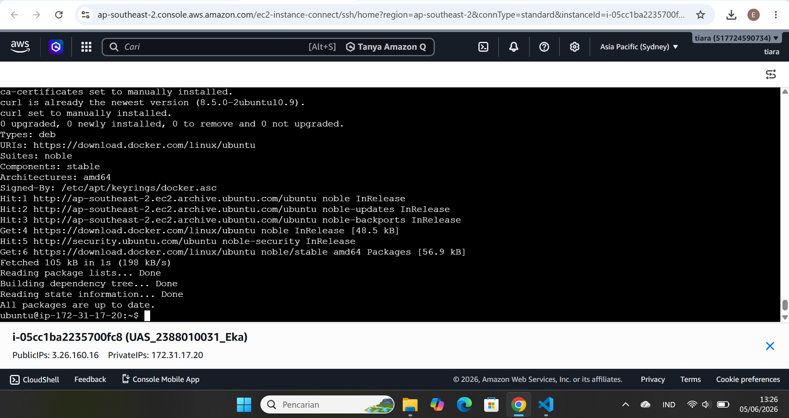

6. cek systemctrl running
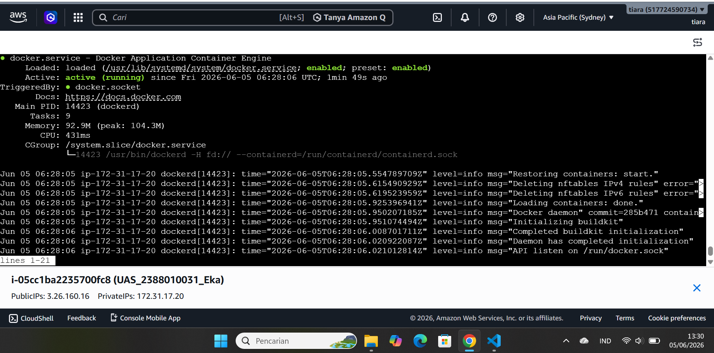

7. buat respostory
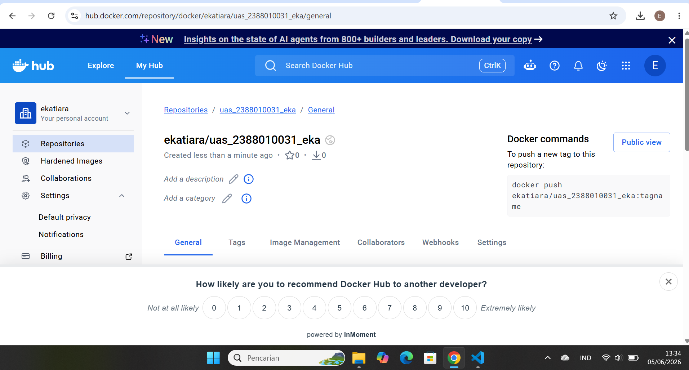

8. buat token di docker
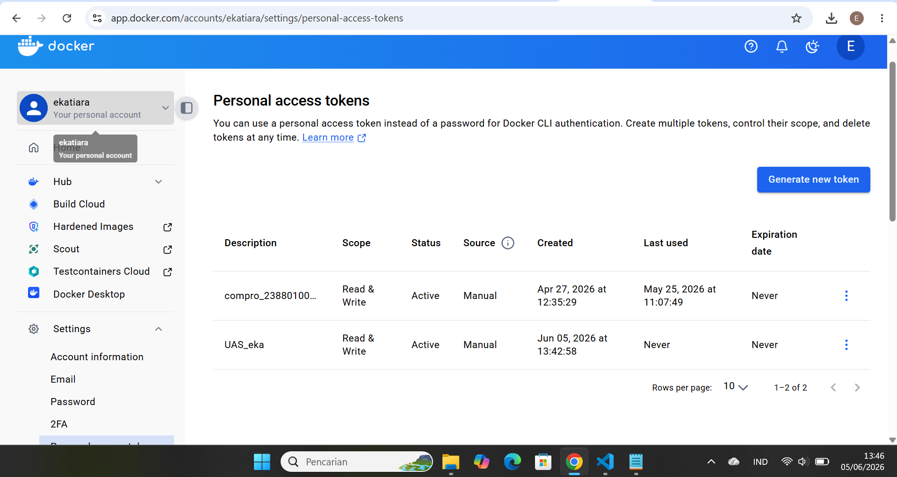

9. buat secret_key github
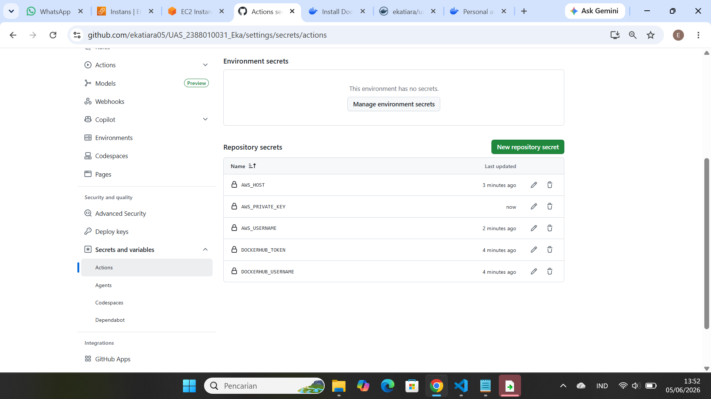

10. Deploy web statis
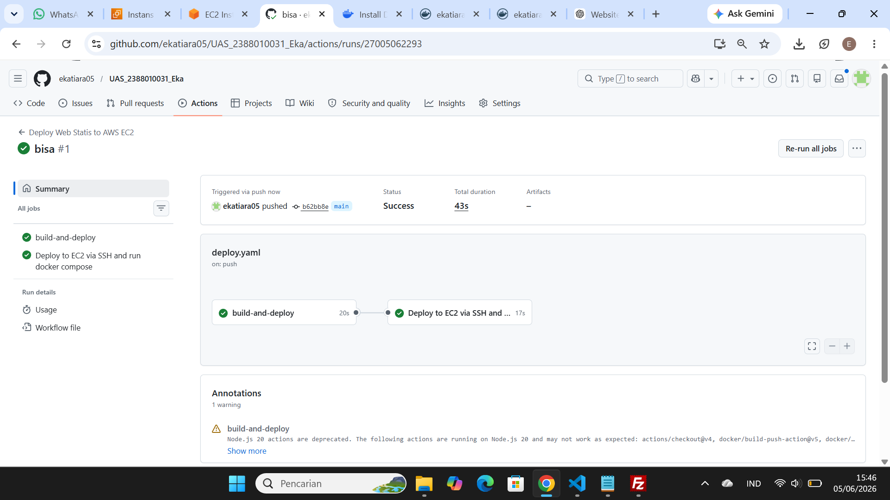

11. Tampilan cv 
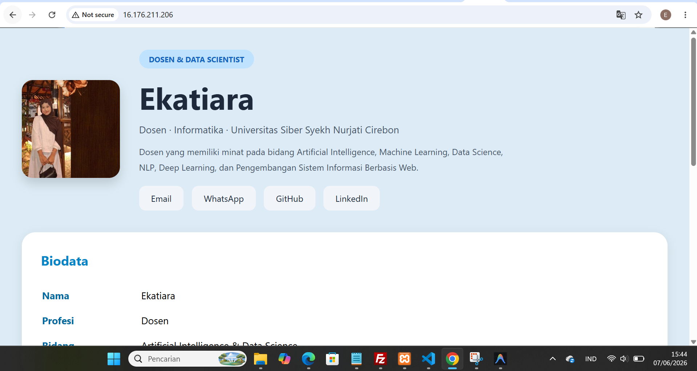

WEB DINAMIS
1. Buat repo docker untuk web dinamis
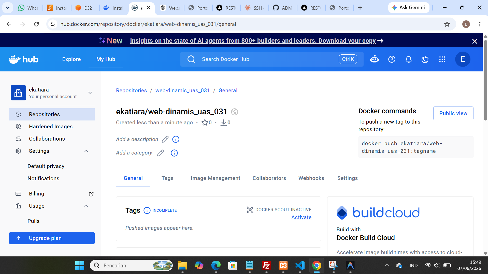

2. buat Website dinamis restoran

    - Buat Dockerfile yg menyesuaikan dengan bahasa dipakai (next.js)
    - Buat juga file docker-compose.yml di dalam folder web-dinamis
    - Buat deploy-web-dinamis.yml

3. Deploy Web-Dinamis
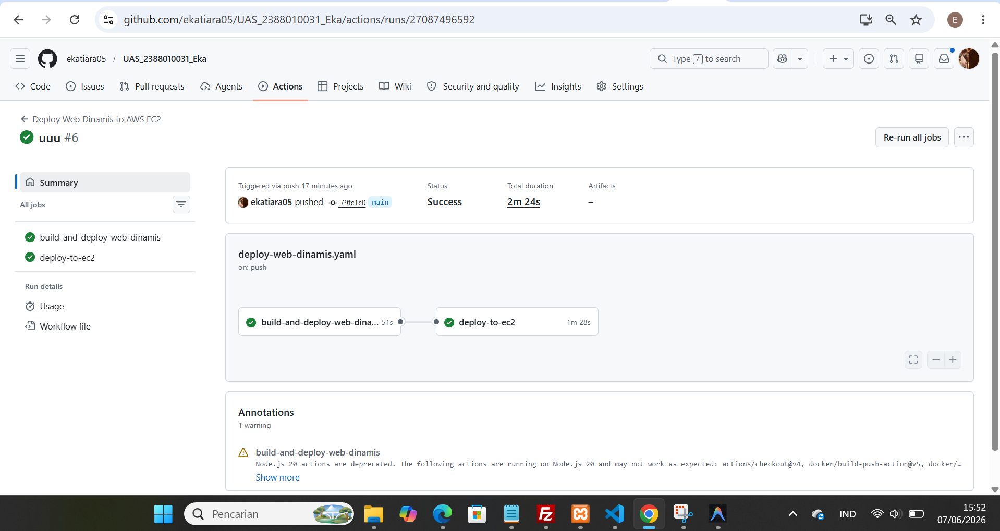

 - tampilan dasboard kopi nusantara
    

- tampilan login
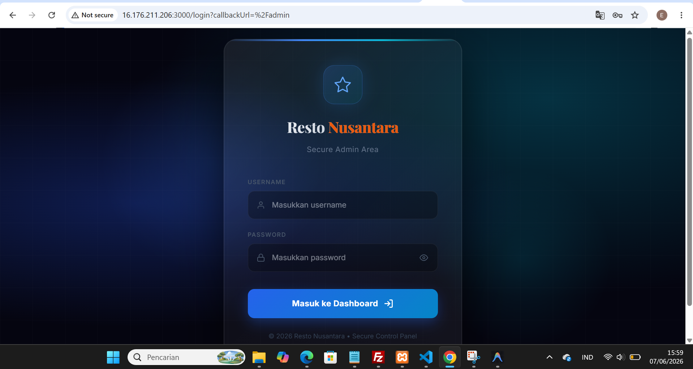

- tampilan dasboard admin
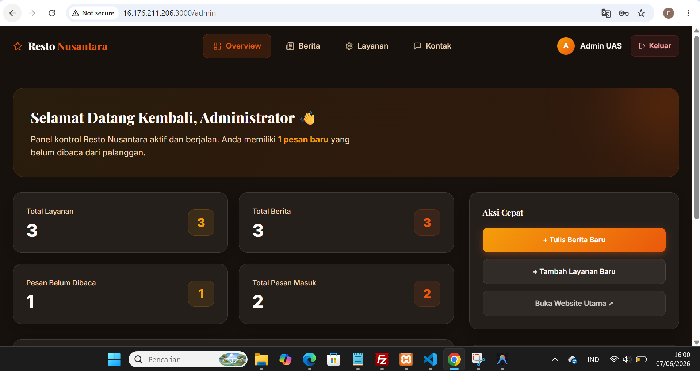
