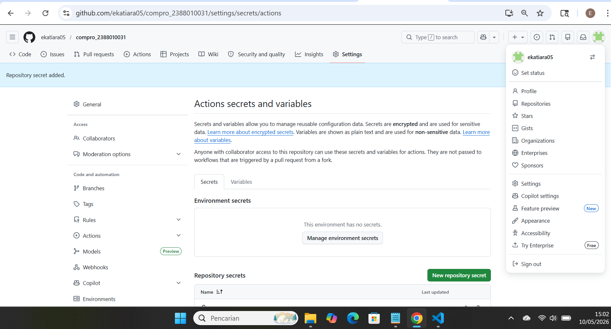
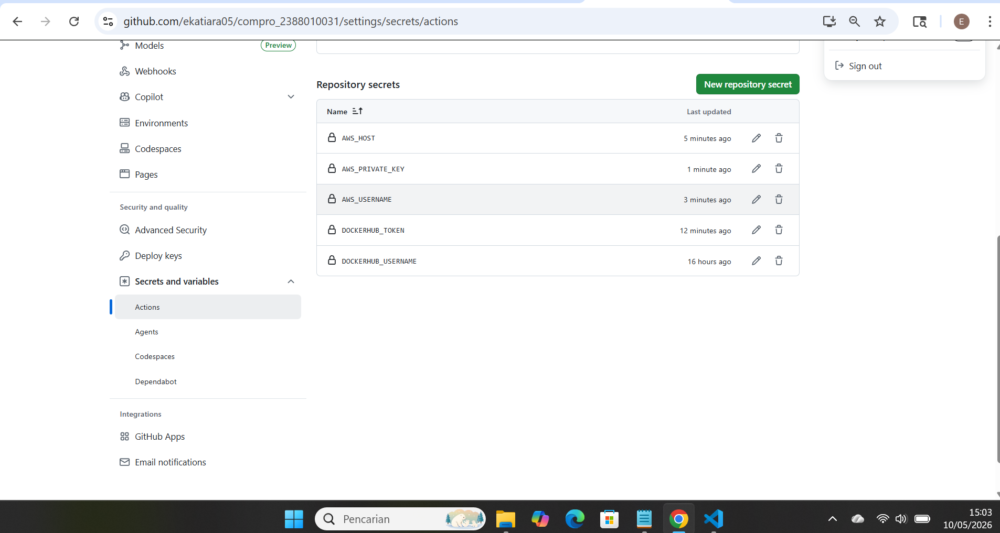
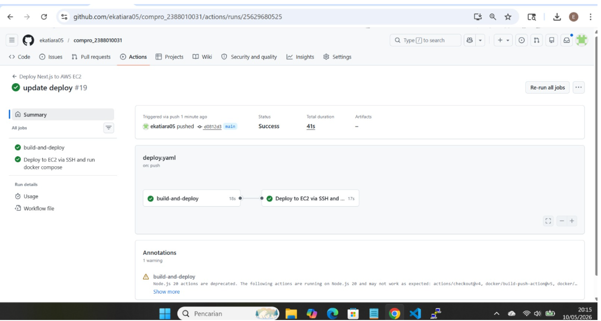
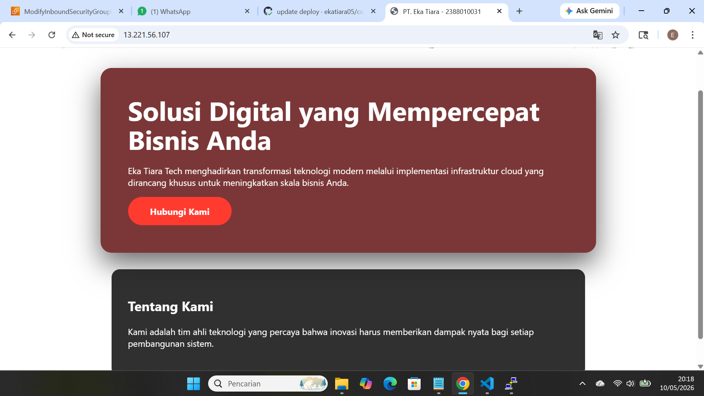

# Modernisasi CI/CD (continuous Integration/Continuous Delivery)

1. Mengisi Secrets Variable di github Actions
    - Buka Repository di Github
    - Klik settings -> Secrets and variable -> actions
    - Isi nama = DOCKERHUB_USERNAME dan value = -username akun  dockerhub
    - Klik new repository secret
    - Isi nama = DOCKERHUB_TOKEN dan value = -token akun dockerhub 
    - KLik New repository secret 
    Isi nama = AWS_HOST dan value = -ip address EC2 instance 
    - klik new repository secret 
    - Isi nama = AWS_USERNAME dan value = ubuntu
    - KLik New repository secret 
    - isi Nama = AWS_PRIVATE_KEY dan value = file .pem (berisi tanda petik awal dan akhir juga)

2. Melakukan edit file Pipeline di Github
    - Buka Projek compro_nim
    - Buat Folder Baru .github -> Buat folder workflows -> Buat File deploy.yaml
    - Isi file deploy.yaml sebagai berilkut :
name: Deploy Next.js to AWS EC2 on: push: branches: [ main ]

jobs: build-and-deploy: runs-on: ubuntu-latest steps: - name: Checkout code uses: actions/checkout@v4
name: Deploy Next.js to AWS EC2
on:
  push:
    branches: [ main ]
jobs:
  build-and-deploy:
    runs-on: ubuntu-latest
    steps:
    - name: Checkout code
      uses: actions/checkout@v4
    - name: Login to Docker Hub
      uses: docker/login-action@v3
      with:
        username: ${{ secrets.DOCKERHUB_USERNAME }}
        password: ${{ secrets.DOCKERHUB_TOKEN }}
    - name: Build and push Docker image
      uses: docker/build-push-action@v5
      with:
        context: .
        push: true
        tags: ${{ secrets.DOCKERHUB_USERNAME }}/compro_2388010031:latest

  deploy:
    needs: build-and-deploy
    runs-on: ubuntu-latest
    name: Deploy to EC2 via SSH and run docker compose
    steps:
    - name: SSH and deploy
      uses: appleboy/ssh-action@v1.0.3
      with:
        host: ${{ secrets.AWS_HOST }}
        username: ${{ secrets.AWS_USERNAME }}
        key: ${{ secrets.AWS_PRIVATE_KEY }}
        port: 22
        script: |
          docker rm -f compro_nim || true
          docker pull ${{ secrets.DOCKERHUB_USERNAME }}/compro_2388010031:latest
          docker run -d --name compro_2388010031 -p 80:80 ${{ secrets.DOCKERHUB_USERNAME }}/compro_2388010031:latest

3. Sebelum melakukan commit dan synch pada file 
    - pastikan sudah disable apache2 -> sudo systemctl disable  apache2
    - pastikan sudah stop apache2 -> sudo systemchtl stop apache2
    - pastikan user ubuntu sudah ditambahkan ke docker -> sudo usermod -aG docker ubuntu 
    - pastikan sudah logout ->exit 
    - Baru lakukan Commit dan push ke Githup
   
   