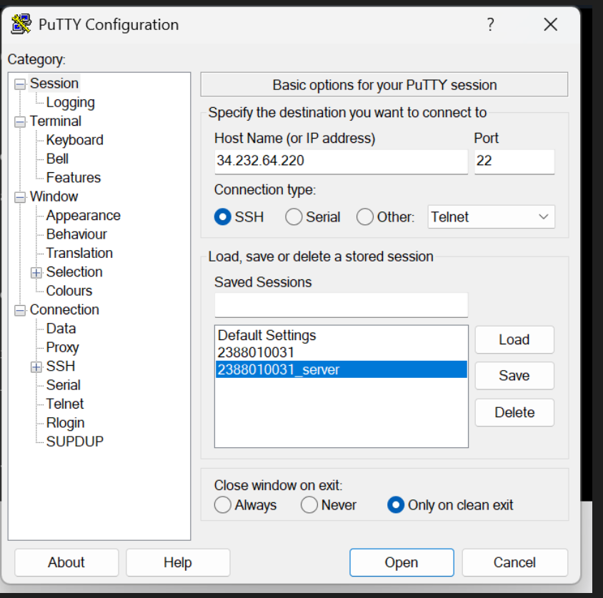
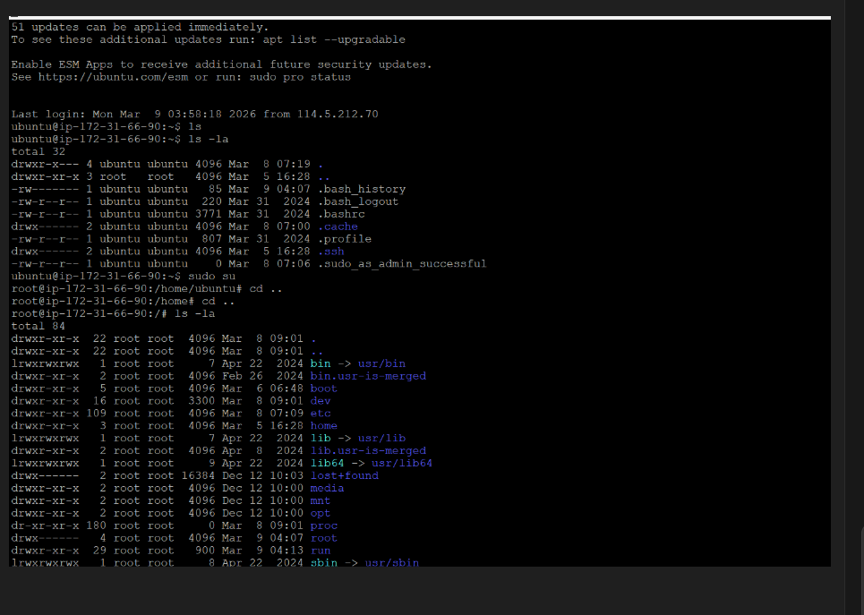
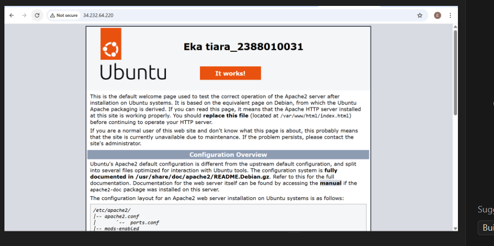

1. start Instance
2. Buka putty
3. kemudian load save session yang disimpan pada pertemuan-2 (NIM_server)
4. update bagian ipAddress V4

5. sudo apt-get update (untuk paching OS Linuk server)
6. cek Web server kita (systemctl status apache2)
7. sudo systemctl stop apache2 (uuntuk berhentikan web server)
8. sudo systemctl start apache2 (untuk start ulang web server)

9. masukan command (ls -la) untuk melihat directory tempat cursor aktif
10. masukan sudo su (untuk masuk ke home)
11. masukan cd .. untuk ke Root Folder ls-la

12. masukan ke folder Var (cd/var/www/html)
13. nano index.html untuk custom Nama dan NIM
