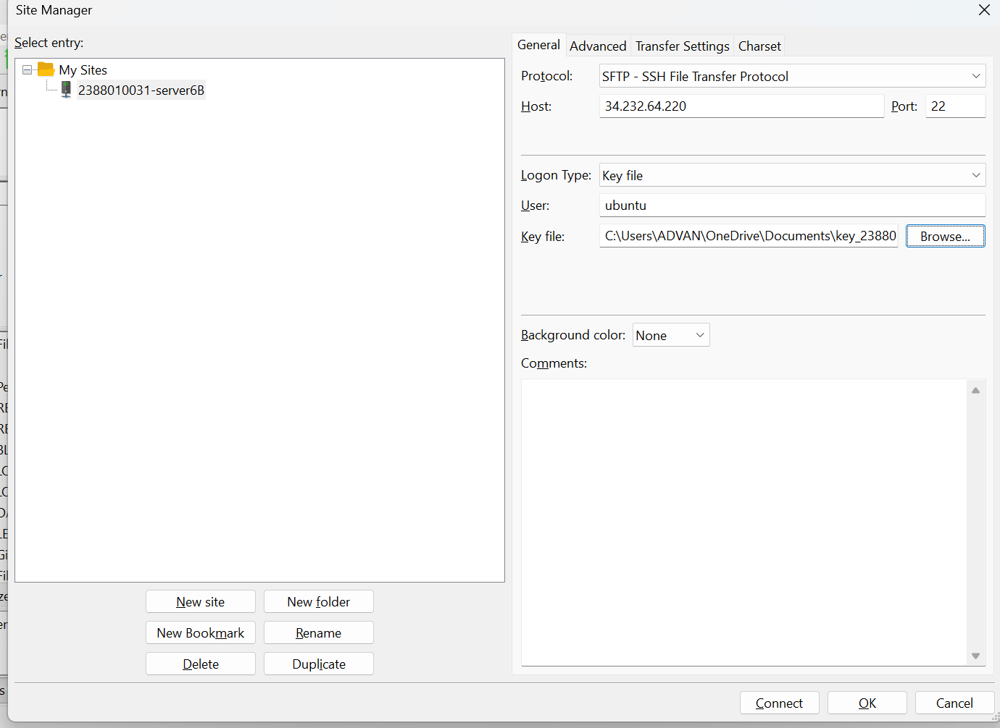
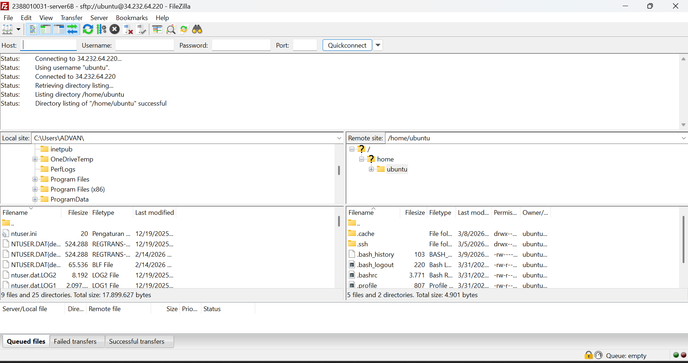
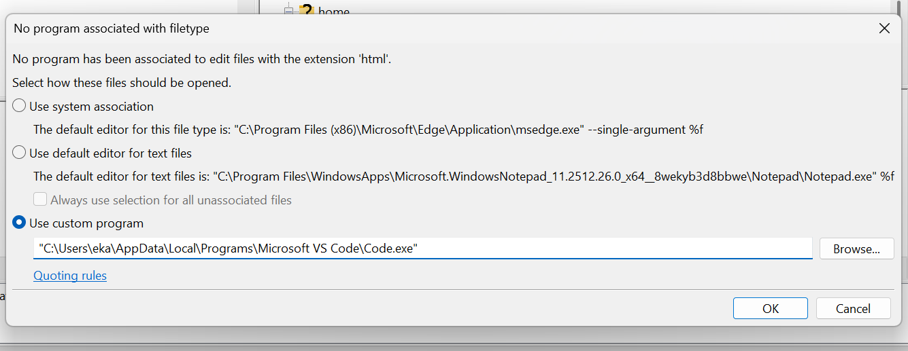
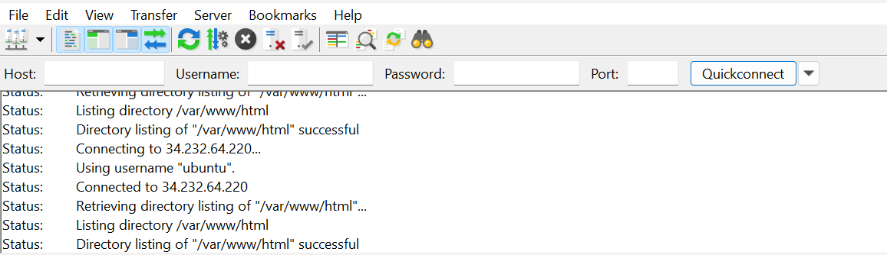
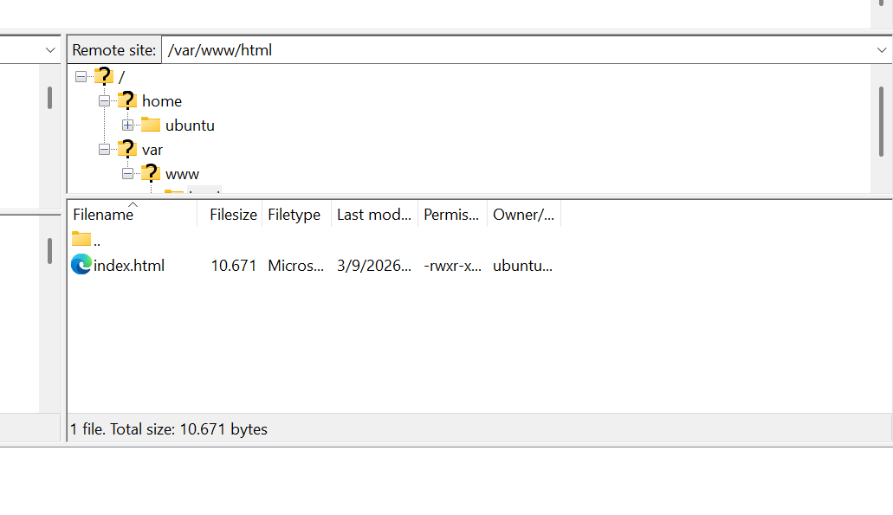
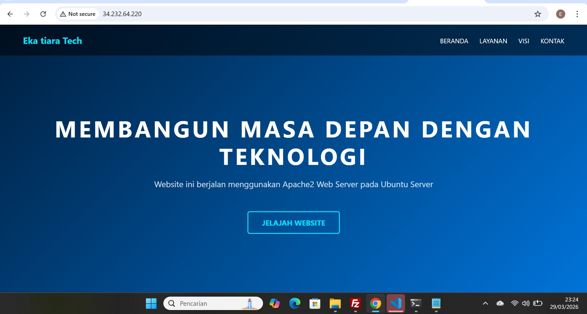

# Migrasi File Local ke Cloud Server (AWS EC2)

1. Memilih tools Migrasi File, misal kata akan gunakan filezilla
 - unduh dan instal di https://filezilla-project.org/download.php?type=client
 - Buka filezilla Client
 - Aktifkan Instance di AWS
 - kebali ke filezilla Client
 - Klik file > site manager
 - Klik New Site
 - Protocol > SFTP
 - Host > IP Public EC2
 - Port > 22
 - Logon Type > Key file
 - User > ubuntu
 - Key file > Pilih     file .ppk / .pem yg didownload saat membuat instance
 -  Klik Ok
 - CTRL + S
 - Klik Connect
 

 2. Pada Dashboard utama fileZilla akan terbagi menjadi 2 panel
 - Panel Kiri > File Local (Komputer Anda)
 - Panel Kanan > File Server (AWS EC2) 
 

 3. Arahkan directory Cloud (Panel Kanan) ke Folder web server services area
 - /var/www/html
 

 4. untuk solusi Permission Denied pada folder /var/www/html
 - Ubah Kepemilikan  Folder
 - Mengubah folder/var/www/html agar bisa diakses oleh user 'ubuntu'
 - Sintaks: sudo chown - R ubuntu:ubuntu /var/www/html sudo chown -R ubuntu:ubuntu /var/www/html

5. Edit File index.html menjadi company Profile
 - Klik kanan pada file index.html
 - klik edit
 - edit file index.html menjadi company profile
 