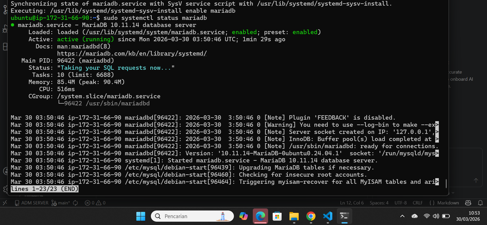
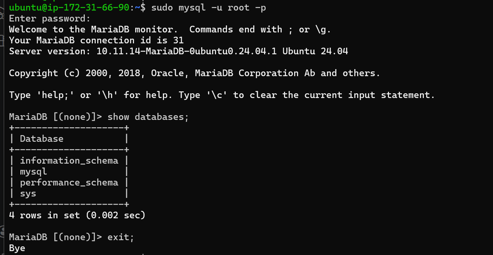
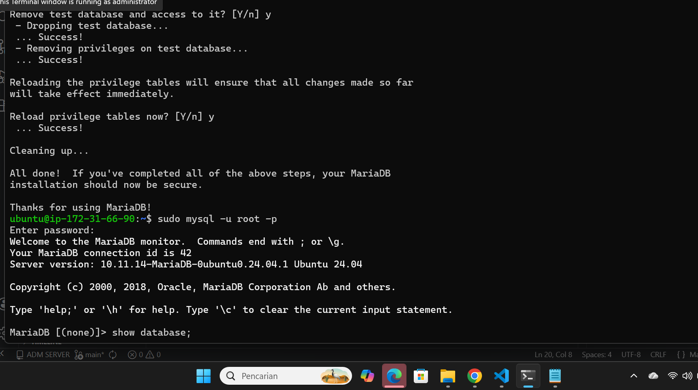
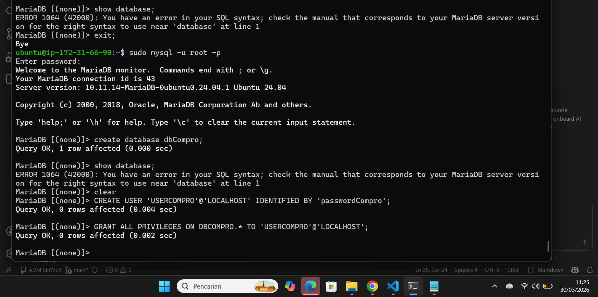
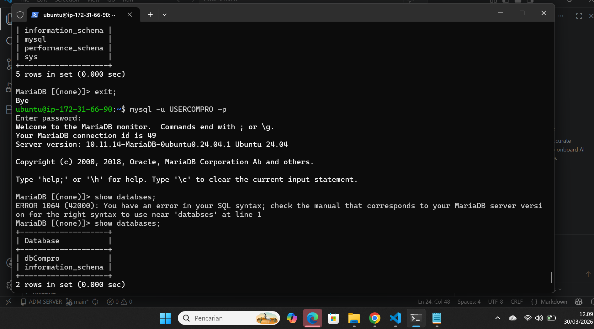

# Membuat Database MySql di AWS EC2

1. aktifkan instance / VM di EC2
2. Remote SSH via terminal 
    - Masuk ke folder penyimpanan Private key AWS
    - masukan command ( ssh -i namafile.pem ubuntu@[IP_ADDRESS])
    - Tekan Enter
3. Lakukan Patching OS
    - sudo apt-get update && sudo apt-get upgrade

4. kita akan install MariaDb
    - sudo apt-get install mariadb-server / mysql-server
    - sudo systemctl status mariadb
    - coba apakah defaul setting yg berlaku (sudo mysql -u root -p)
    - cek apakah masih ada database dummy (show databases;)
    
    

5. kita lakukan hardening security
    - masukan commmand (sudo mysql_secure_installation)
    - masukan password db aws sever : admin123@#
    - remove anonymous users (Y)
    - dissallow root login remotely (Y)
    - remove test database and access to it (Y) 
    - reload privilage tables now(Y)
    

6. Membuat database dan User
    - membuat database untuk web companny profile (create database dbCompro;)
    - Membuat user untuk Web Company Profile (create user ' userCompro'@'localhost'idebtified by 'passwordcompro';)
    - Memberikan hak akses user untuk web Company Profile (grant all privileges on dbCompro.* to 'userCompro '@'localhost';)
    - flush privilege (flush privilages';)
    - keluar dari MySql (exit;)
    

7. login sebagai user baru 
    - masukan command (mysql -u userCompro -p)
    - masukan Password 
    - cek apakah database dbCompro sudah ada (show database;)
    

