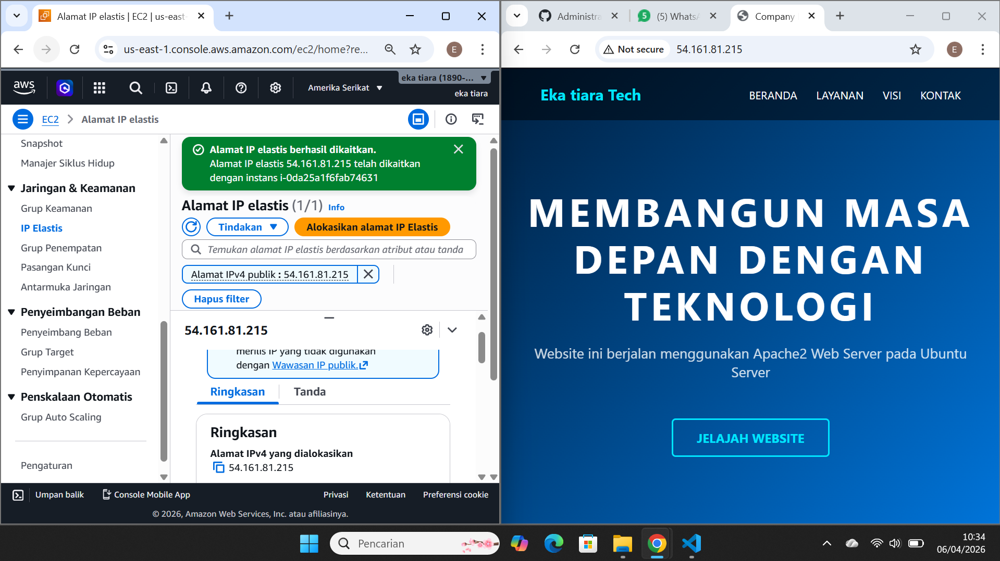
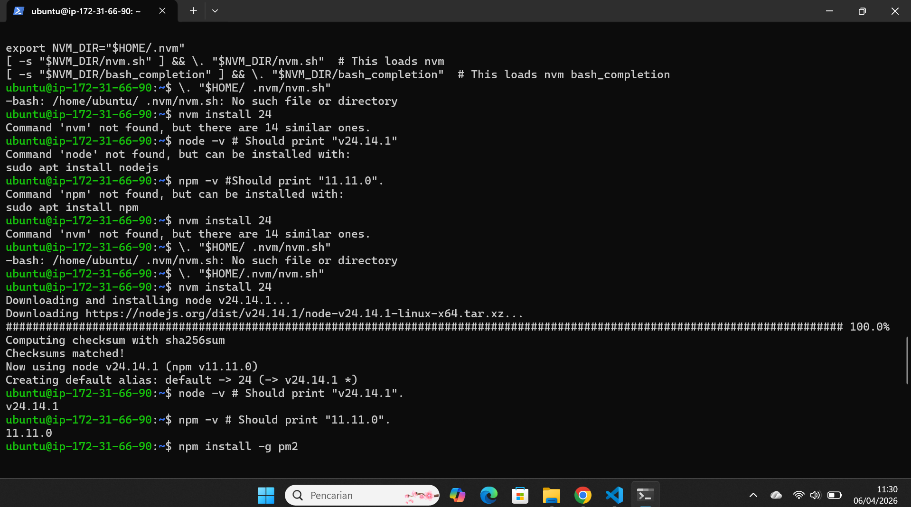
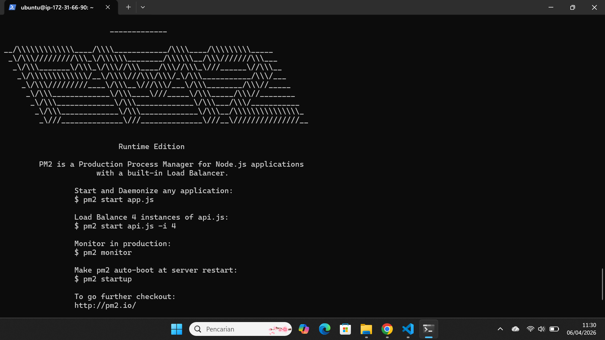

1. jalankan instance EC2 yang sudah di create sebelumnya
2. ke menu network and Security pilih menu Elastic IP 
    - Klik Menu Allocate Elastic IP Address 
    - Pilih Amazon's pool of IPv4 address
    - Network Border Group (South East Asia)
    - Isi Tags (Key=server-6B value=Praktikum Elastic IP)
    - Klik Allocate

3. Associate kan Elastic IP segera mungkin (>1 jam akan kena cost)
    - Centang mana EIP yang dipilih 
    - piliih Actions -> Associate Elastic IP
    - Resource type pilih instance
    - pilih instance (NIM-SERVER6B)
    klik Associate

